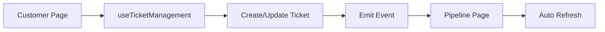
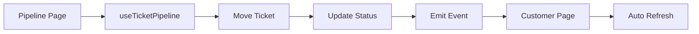

# Ticket Management System Integration Guide

## Overview
The ticket management system now features a robust event-driven architecture that enables seamless communication between the Customer page and Pipeline page. This ensures real-time updates across the application whenever ticket-related actions occur.

## Architecture

### Event Bus System
The system uses a centralized event bus (`ticketEventBus`) that manages all ticket-related events throughout the application.

**Location:** `src/stores/ticketEventBus.ts`

### Available Events
```typescript
TICKET_EVENTS = {
  // Ticket lifecycle
  TICKET_CREATED: 'ticket:created',
  TICKET_UPDATED: 'ticket:updated',
  TICKET_DELETED: 'ticket:deleted',
  TICKET_STATUS_CHANGED: 'ticket:status_changed',
  TICKET_PRIORITY_CHANGED: 'ticket:priority_changed',
  TICKET_ASSIGNED: 'ticket:assigned',
  TICKET_ESCALATED: 'ticket:escalated',
  
  // Comments
  COMMENT_ADDED: 'comment:added',
  COMMENT_UPDATED: 'comment:updated',
  COMMENT_DELETED: 'comment:deleted',
  
  // Time tracking
  TIME_ENTRY_ADDED: 'time:entry_added',
  TIME_ENTRY_UPDATED: 'time:entry_updated',
  
  // Attachments
  ATTACHMENT_ADDED: 'attachment:added',
  ATTACHMENT_DELETED: 'attachment:deleted',
  
  // Pipeline integration
  TICKET_MOVED_TO_STAGE: 'ticket:moved_to_stage',
  TICKET_SLA_BREACH: 'ticket:sla_breach',
  
  // Bulk operations
  TICKETS_BULK_UPDATED: 'tickets:bulk_updated',
  
  // Refresh events
  CUSTOMER_TICKETS_REFRESH: 'customer:tickets_refresh',
  PIPELINE_REFRESH: 'pipeline:refresh',
  GLOBAL_TICKETS_REFRESH: 'global:tickets_refresh',
}
```

## Data Flow

### 1. Customer Page → Pipeline Page

**Scenario:** User creates or updates a ticket in Customer page



**Code:**
```typescript
// In Customer page - creating a ticket
const { handleCreateTicket } = useTicketManagement();

await handleCreateTicket(customerId, ticketData);
// ✅ Automatically emits TICKET_CREATED event
// ✅ Automatically emits PIPELINE_REFRESH event
// ✅ Pipeline page refreshes automatically
```

### 2. Pipeline Page → Customer Page

**Scenario:** User moves a ticket between stages in Pipeline



**Code:**
```typescript
// In Pipeline page - moving a ticket
const { handleTicketMove } = useTicketPipeline();

await handleTicketMove(ticketId, fromStageId, toStageId);
// ✅ Automatically emits TICKET_MOVED_TO_STAGE event
// ✅ Automatically emits TICKET_STATUS_CHANGED event
// ✅ Customer page refreshes automatically
```

### 3. Comment System Integration

**Scenario:** User adds comment to a ticket

```typescript
// In any component
import { addTicketComment } from '@/services/ticketCommentService';

await addTicketComment(ticketId, userId, userName, comment, isInternal);
// ✅ Automatically emits COMMENT_ADDED event
// ✅ All views listening to this ticket refresh
```

## Using the Event System

### Subscribe to Events
Use the `useTicketEvents` hook in your components:

```typescript
import { useTicketEvents } from '@/hooks/useTicketEvents';

function MyComponent() {
  const { onTicketCreated, onTicketStatusChanged, onPipelineRefresh } = useTicketEvents();

  // Listen for ticket creation
  onTicketCreated((data) => {
    console.log('New ticket created:', data);
    // Refresh your component's data
  });

  // Listen for status changes
  onTicketStatusChanged((data) => {
    console.log('Ticket status changed:', data);
    // Update UI accordingly
  });

  // Listen for pipeline refresh requests
  onPipelineRefresh(() => {
    // Refresh pipeline data
  });
}
```

### Emit Events
Events are automatically emitted by service functions, but you can emit custom events:

```typescript
import { ticketEventBus, TICKET_EVENTS } from '@/stores/ticketEventBus';

// Emit a custom event
ticketEventBus.emit(TICKET_EVENTS.TICKET_SLA_BREACH, {
  ticketId: '123',
  message: 'SLA deadline approaching'
});
```

## Integration Points

### 1. Customer Page Integration
**Files:**
- `src/hooks/useTicketManagement.ts` - Ticket CRUD operations
- `src/components/customers/TicketManagementDialog.tsx` - Ticket dialog
- `src/components/customers/tickets/` - Ticket components

**Events Emitted:**
- `TICKET_CREATED` - When new ticket is created
- `TICKET_UPDATED` - When ticket is modified
- `TICKET_STATUS_CHANGED` - When status changes
- `TIME_ENTRY_ADDED` - When time is logged
- `CUSTOMER_TICKETS_REFRESH` - Request customer view refresh

### 2. Pipeline Page Integration
**Files:**
- `src/hooks/useTicketPipeline.ts` - Pipeline logic
- `src/components/pipeline/TicketPipeline.tsx` - Pipeline view

**Events Emitted:**
- `TICKET_MOVED_TO_STAGE` - When ticket moves between stages
- `TICKET_STATUS_CHANGED` - When status changes via pipeline

**Events Listened To:**
- `PIPELINE_REFRESH` - Refreshes entire pipeline view

### 3. Comment System Integration
**Files:**
- `src/services/ticketCommentService.ts` - Comment operations
- `src/components/customers/tickets/TicketComments.tsx` - Comment UI

**Events Emitted:**
- `COMMENT_ADDED` - New comment added
- `COMMENT_UPDATED` - Comment edited
- `COMMENT_DELETED` - Comment removed

## Benefits

### 1. Real-Time Synchronization
✅ Changes in one view immediately reflect in others
✅ No manual refresh required
✅ Consistent data across all pages

### 2. Decoupled Architecture
✅ Components don't need direct references to each other
✅ Easy to add new features without breaking existing ones
✅ Better code maintainability

### 3. Enhanced User Experience
✅ Instant feedback on actions
✅ Always viewing current data
✅ Seamless workflow between pages

### 4. Scalability
✅ Easy to add new event types
✅ Simple to integrate new components
✅ Performance optimized with targeted updates

## Example Use Cases

### Use Case 1: Creating a Ticket
```typescript
// 1. User creates ticket in Customer page
await handleCreateTicket(customerId, ticketData);

// 2. Events emitted automatically:
// - TICKET_CREATED
// - CUSTOMER_TICKETS_REFRESH
// - PIPELINE_REFRESH

// 3. Results:
// ✅ Ticket appears in customer's ticket list
// ✅ Ticket appears in Pipeline page
// ✅ Ticket count updates everywhere
```

### Use Case 2: Moving Ticket in Pipeline
```typescript
// 1. User drags ticket from "Open" to "In Progress"
await handleTicketMove(ticketId, 'open', 'in-progress');

// 2. Events emitted automatically:
// - TICKET_MOVED_TO_STAGE
// - TICKET_STATUS_CHANGED

// 3. Results:
// ✅ Ticket status updates in database
// ✅ Customer page shows new status
// ✅ Pipeline reflects new position
```

### Use Case 3: Adding a Comment
```typescript
// 1. User adds comment to ticket
await addTicketComment(ticketId, userId, userName, comment);

// 2. Events emitted automatically:
// - COMMENT_ADDED

// 3. Results:
// ✅ Comment appears immediately
// ✅ All viewers see the new comment
// ✅ Notification sent if applicable
```

## Best Practices

### 1. Always Use Event System
❌ **Don't** manually refresh data after actions
✅ **Do** rely on event system for updates

### 2. Handle Cleanup
```typescript
useEffect(() => {
  const unsubscribe = ticketEventBus.on(EVENT_NAME, callback);
  return unsubscribe; // Clean up on unmount
}, []);
```

### 3. Provide Context in Events
```typescript
// ✅ Good - includes context
ticketEventBus.emit(TICKET_EVENTS.TICKET_CREATED, {
  ticketId: '123',
  customerId: '456',
  ticket: ticketData
});

// ❌ Bad - missing context
ticketEventBus.emit(TICKET_EVENTS.TICKET_CREATED);
```

### 4. Error Handling
```typescript
try {
  await createTicket(data);
  ticketEventBus.emit(TICKET_EVENTS.TICKET_CREATED, data);
} catch (error) {
  // Don't emit events on failure
  console.error('Failed to create ticket:', error);
}
```

## Troubleshooting

### Events Not Firing
1. Check if event is emitted after successful operation
2. Verify event name matches exactly
3. Ensure error handling doesn't prevent emission

### Duplicate Updates
1. Check for multiple event listeners
2. Verify cleanup functions are called
3. Use React.StrictMode to catch issues

### Performance Issues
1. Debounce high-frequency events
2. Use targeted refresh instead of global
3. Implement pagination for large datasets

## Future Enhancements

### Planned Features
- [ ] WebSocket integration for multi-user real-time updates
- [ ] Event replay for debugging
- [ ] Event persistence for audit trails
- [ ] Optimistic UI updates with rollback
- [ ] Event batching for bulk operations
